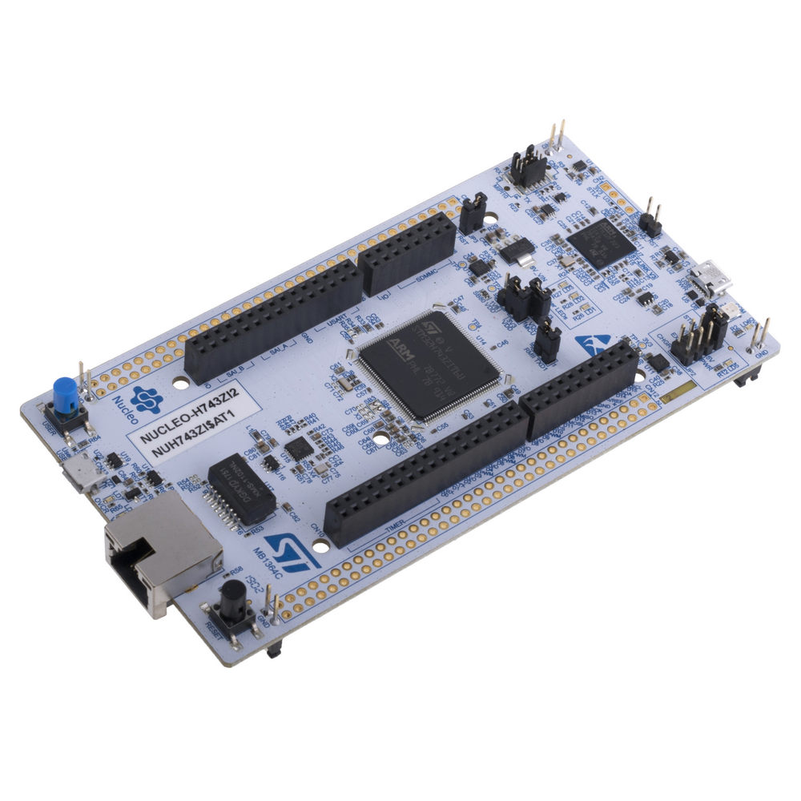
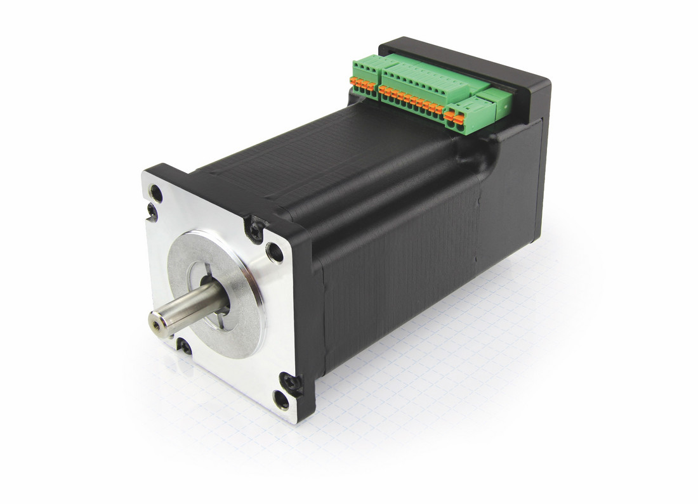

# This is a testcode for the library of FDCAN on STM32 for commisioning Stepper motors with integrated controller

A library for Flexible Data Control Area Network developed for control of NANOTEC stepper motors with integrated controller. 

## Installation 

STMCubeMX IDE is used to specify the clock source for the periphirial in the input-output map. 

System Workbench IDE based on eclipse is used for coding. 

## Development board

The board used for developing this library is [Nucleo STM32H743ZI2](https://www.st.com/en/evaluation-tools/nucleo-h743zi.html#sample-buy)  

## Libraries 
 
The following library are included from [Kugle embedded](https://github.com/mindThomas/Kugle-Embedded). 

- Timer

## FDCAN - STANDARD CAN Library 

The FDCAN library can be located in the libraries folder and it comprises three parts. 

- **FDCAN** Manages the hardware peripherial and CAN frames send and receive. 
- **NANOTEC_Bus** Manages the coding and decoding of CAN messages format for the [NANOTEC](https://en.nanotec.com/products/1609-pd4-c6018l4204-e-08/) motors. 
- **NANOTEC** Specific library for writing and reading registers to the motor, also containing methods to activate the internal state machine of the motor controller and commissioning.  
- **NanotecMotorRegisters** Register Library for all the objects in the motor controller. The registers include standard registers from CiA 402 in the CAN standard. 

 

## Kinematics for the motor configuration 

The kinematics library located in the Estimators folder is auto generated using MATLAB. 

It is based on tilting the motors on that are on top of the ball. 

